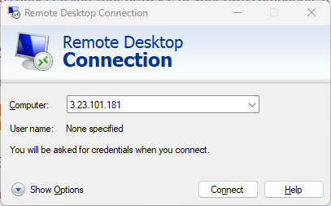

# Using the Environment

The Virtual Machine comes preinstalled with the following programs:

## Connected to the Virtual Machine
These instructions assume that you are using a Windows Machine. If you are not, contact your manager to request access to a Windows Machine.

1. Open the Windows menu, and then search for `Remote Desktop Connection` or `RDC`.
2. Choose **Remote Desktop Connection** in the search results

3. In the Computer text box, enter your Windows instance’s public IP address. The IP address will be given to you by your Manager.  

4. Choose **Show Options** to view additional connection options.
5. In the **User Name** text box, enter `Administration`, which is the default user name for all Windows instances in Lightsail.

6. Choose **Connect**
7. In the prompt that appears, enter or paste the default administrator password that you copied from the Lightsail console earlier in this procedure, and then choose **OK**. The password will be given to you by your Manager.  

8. In the prompt that appears, choose Yes to connect to the Windows instance despite certificate errors.  

After you’re connected to the instance, you should see a screen similar to the following example:
